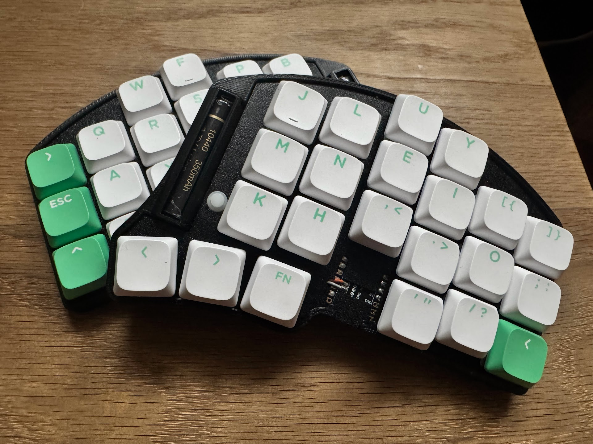
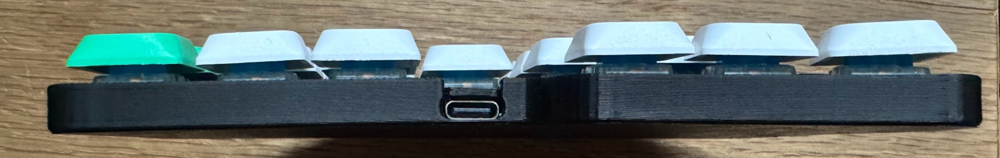
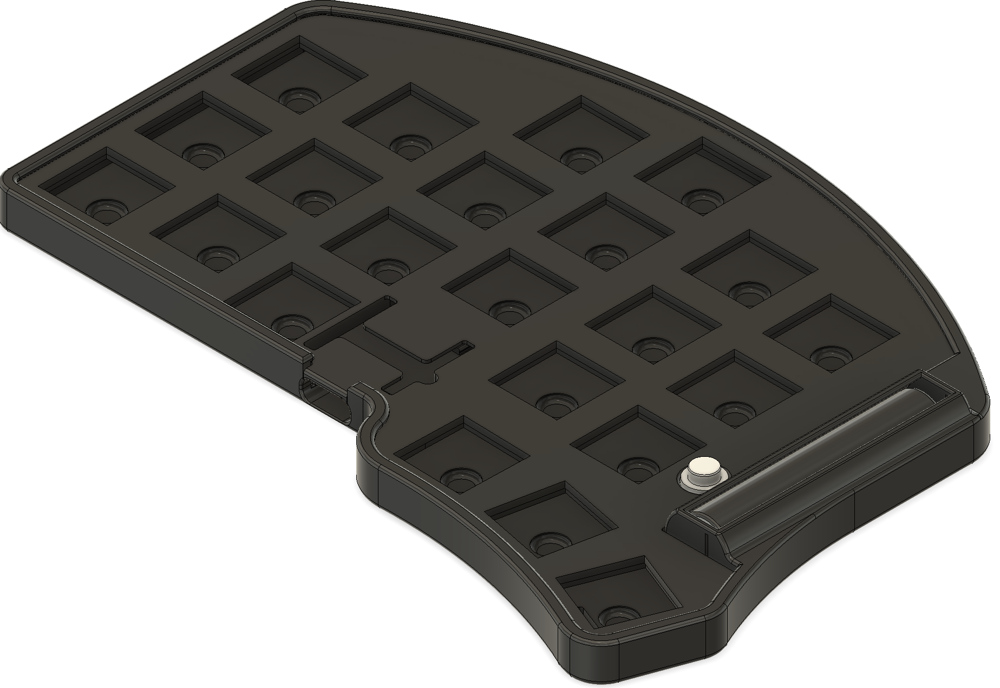
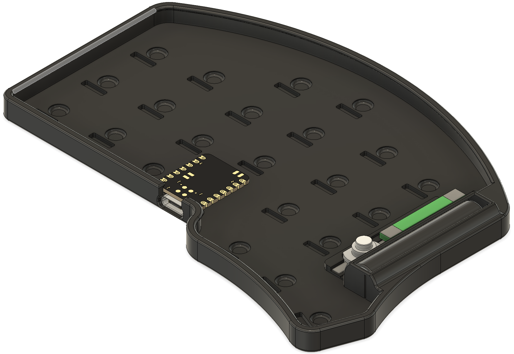
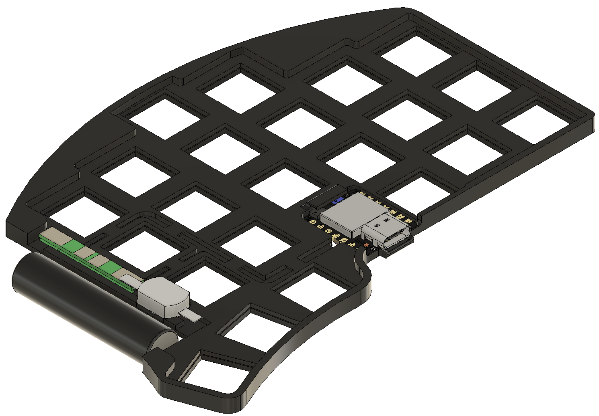

# Ten44 Keyboard

The **Ten44 Keyboard** is named after the **10440 lithium-ion battery** it uses — a compact 10mm × 44mm cell holding about **300–400mAh** of capacity.  
It also features **44 total keys**, staying true to its namesake in both form and function.

---

## Overview

This project began as a **design challenge** to build a **low-cost, ultra-slim split keyboard** entirely from scratch.  
There’s **no PCB** — the keyboard was designed to avoid import tariffs and high PCB production/shipping costs at the time, which would have made the build prohibitively expensive.

The result is a **minimalist, portable keyboard** that balances functionality, affordability, and design aesthetics.

---

## Hardware

### Microcontroller
The keyboard uses the **Seeed Xiao nRF52840**, chosen for its:

- **Compact form factor**
- **Low power draw**
- **Integrated charging circuitry**
- **Built-in Bluetooth capabilities**
- **Lower cost** than the Nice!Nano
- **Higher reliability** compared to Pro Micro nRF52840 boards (Nice!Nano clones)

The Microcontroller remains **partially exposed** by design — both for aesthetics and to maintain the **super-slim profile** while simplifying assembly.

---

## Design & Customization

The entire keyboard was modeled in **Fusion 360** and includes **STEP files** for those who want to modify the layout.

You can easily adjust **key stagger or spacing** by:
1. Moving the key cutouts.
2. Using the **Solid → Combine → Cut (keep tools)** operation to regenerate the switch and base plate cutouts.

⚠️ **Important:** Avoid intersecting the cutouts for the **microcontroller**, the **battery cable channels**, and **be mindful of keycap footprint**.

---

## 3D Printing Details

- **No supports required**
- **Minimal material usage**
- **No screws or inserts** — the case snaps together securely
- Designed for **standard FDM printers** with a **0.4mm nozzle** @**0.2mm layer height**

### Battery Holder
- Integrated **10440 battery compartment**
- Includes a **removable access door** for easy installation or replacement

**Filament notes:**
- **PLA** is more brittle — use care when opening/closing the battery door.
- **PETG or ABS** offer better flexibility and durability.
- If tight, gently warm the hatch with a **hair dryer or lighter (at a safe distance)** before operation.
- Frequent use of the door is **not recommended**.

### Printing Tip
Only **one set of case files** is provided — be sure to **mirror the parts** before printing the opposite half.

---

## Switches & Keycaps

The design is based on **Gateron Low-Profile KS-33** mechanical switches due to their:
- Low cost
- Wide availability
- **MX stem compatibility**

**Kailh Choc v1** switches were considered but dismissed due to limited and expensive keycap options.

The total keyboard thickness depends on your keycap choice, though the case adds only about **0.4mm** — a deliberate detail to conceal the switch bottoms for a cleaner appearance.

---

## Access & Power

### Reset Button
Accessible from the **bottom of the case** using a paperclip or SIM tool.  
There are **two holes** due to mirroring file requirements, but only the one **right** of the USB port activates reset.

### Power Switch
The power switch sits **between the BMS and the battery**, preventing **parasitic drain** when powered off.  
However, the keyboard must be **turned on while charging**, since the battery is disconnected when off.

### Microcontroller Battery Terminals
Ideally the exposed connact points should be sealed using either UV resin, small amounts of hot glue, or similar to prevent shorts.

### Battery Terminals 
These are 4mm nickel strips with the ends interfacing with the battery folded over on itself multiple times to give the battery a snug fit in the compartment.
The battery is oriented with positive terminal facing toward the top of the keyboard and BMS must also be installed in the same manner.

---

## Summary

| Feature | Description |
|----------|--------------|
| **Battery** | 10440 Li-ion (300–400mAh) | 
| **Microcontroller** | Seeed Xiao nRF52840 |
| **Switches** | Gateron Low-Profile KS-33 |
| **Keys** | MX stem |
| **Material** | PLA / PETG / ABS |
| **Printing** | No supports, no screws, minimal material |
| **CAD Software** | Fusion 360 |
| **Design Files** | STEP format (modifiable) |

---

## Parts List

### Components
- **44×** Gateron Low Profile KS-33 Mechanical Switches  
- **44×** Diodes — 1N4148 or similar (1 per switch)  
- **2×** Seeed Xiao nRF52840  
- **2×** 1s BMS for 10440 battery  
  - *Optional but highly recommended for safety*  
  - *Ideally with tabs for re-use as battery terminal contact points — otherwise use 4mm wide metal strips*  
  - Example: [BMS on Amazon](https://www.amazon.com/dp/B0F92KP8RD)  
- **2×** 10440 Lithium-Ion Batteries  
- **2×** On/Off push power switches  
  - Example: [Switch on Amazon](https://www.amazon.com/dp/B0DBHTDBL7)  
- **4× (~4"/100mm)** 24–28AWG stranded wires for battery connection  
  - To be cut to length  
  - Small internal channels are provided for wire routing  
- **Enamel-coated wire (0.1mm–0.2mm)** for matrix row and column wiring  
- **22AWG** (solid core preferred) for column connections  

---

### Tools

- Soldering iron  
  - Solder  
  - Flux  
- Tweezers *(optional, helpful for wire management)*  
- Flush cutters  
- Multimeter *(optional, for continuity testing)*  
- Hot glue or resin *(optional, for securing wires and preventing shorts)*  

---

## Matrix Wiring

### Pin Connections

**Row Pins:**
- GPIO D1 → Row 1  
- GPIO D2 → Row 2  
- GPIO D9 → Row 3  
- GPIO D10 → Row 4  

**Column Pins:**
- GPIO D3 → Col 1  
- GPIO D4 → Col 2  
- GPIO D5 → Col 3  
- GPIO D6 → Col 4  
- GPIO D7 → Col 5  
- GPIO D8 → Col 6  

**Notes:**
- Wiring is done on the **underside of the switch plate**.  
- **Diode orientation:**  
  - The **cathode (striped end)** faces the **column side**.  
  - The **anode (non-striped end)** connects to the **switch pin**.  
- **Row wires** solder to the opposite switch pin.  
- **Column wires** solder to the **diode cathode**.
<pre>          Right Half:                              Left Half:
R1        [C1]  [C2]  [C3]  [C4]  [C5]  [C6]       [C1]  [C2]  [C3]  [C4]  [C5]  [C6]        R1
R2        [C1]  [C2]  [C3]  [C4]  [C5]  [C6]       [C1]  [C2]  [C3]  [C4]  [C5]  [C6]        R2
R3        [C1]  [C2]  [C3]  [C4]  [C5]  [C6]       [C1]  [C2]  [C3]  [C4]  [C5]  [C6]        R3
R4  [C1]  [C2]  [C3]        [C4]                               [C3]        [C4]  [C5]  [C6]  R4
</pre>

### License

This project is licensed under the  
**Creative Commons Attribution-NonCommercial-ShareAlike 4.0 International License (CC BY-NC-SA 4.0).**

You are free to share and adapt this design for personal use, but commercial use or sale of the design, derivatives, or kits is not permitted.
More information: [https://creativecommons.org/licenses/by-nc-sa/4.0/](https://creativecommons.org/licenses/by-nc-sa/4.0/)

### Acknowledgements
Special thanks to the GrabCAD community for the **Seeed Studio Xiao nRF52840 Sense 3D model**,  
which was used as a reference in this project:  
[https://grabcad.com/library/seeed-studio-xiao-nrf52840-sense-1](https://grabcad.com/library/seeed-studio-xiao-nrf52840-sense-1)
